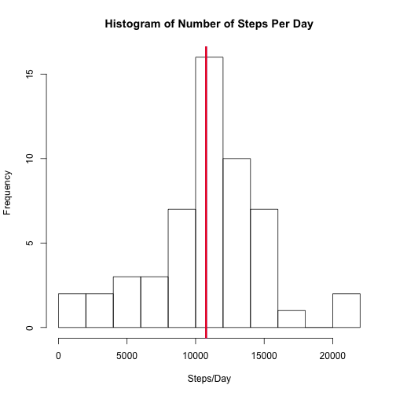
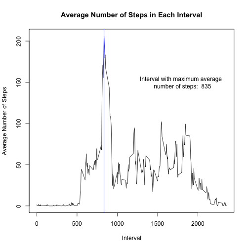
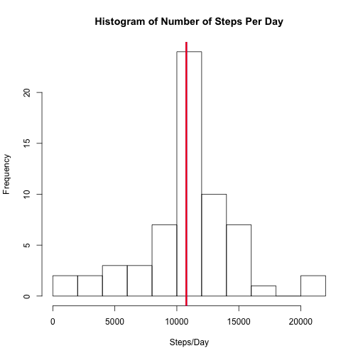
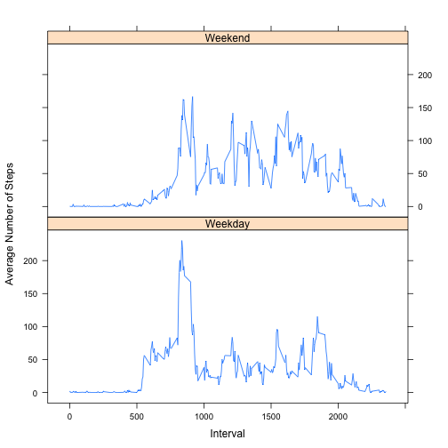

Analysis of Activity Monitoring Data
====================================

For this assignment I perform some simple analysis of personal
activity monitoring data that records the number of steps for a single
individual in 5-minute intervals over a two month period in October
and November, 2012.

The goal of this assignment is to demonstrate techniques for creating
literate statistical programming documents using *R Markdown* and
*Knitr*. In literate statistical programs explanitory text is
integrated with code chunks in order to tell a complete story of the
data analysis. This is like including very detailed comments in your
analysis scripts, with the additional benefit that they can be
formatted and typeset to create html or other documents.

Knitr is a utility that does this formatting, but also executes the
analysis code at the same time. First, Knitr creates a Markdown
document by running the code and substituting output into the document
in a structured way. Then it can create a html document using
javascript and additionally adding the proper html tags to the
Markdown document.

This report also demonstrates the usage of different plotting methods
to understand and analyse data, as well as a little bit of date object
manipulation. I use the base plotting system in this report for all of 
the plots except the last one which is made in lattice. 

I use the *dplyr* library for this analysis, in order to make it
easier to wield the data. The same functionality can be had using
the *plyr* library. The *lattice* library is needed for the last plot
of this report.


```r
require(dplyr, quietly=TRUE, warn.conflicts=FALSE)
require(lattice, quietly=TRUE)
```

## Loading and preprocessing the data 

I first load the data and convert it to a plyr data table. 
The data is downloaded (and unzipped) from the URL: 
[Activity Monitoring Dataset]
(https://d396qusza40orc.cloudfront.net/repdata%2Fdata%2Factivity.zip).
The dataset is 52 kB, and contains 17,568 observations of three variables,
* steps: The number of steps taken in a given 5-minute observation.
* date: The date on which the observation was made.
* interval: The 5-minute interval on which the observation was made.

There are 288 unique intervals, ranging from 0 to 2355, so covering a
24-hour period.  There are 61 total days over which the experiment was
performed, but only 53 days that have at least some step data.
Some days have no data at all, for instance, October 1, 2012 and
November 4, 2012.

I coerce the date field to be date objects instead of factors. I
also create a clean dataset that is the original dataset with all of
the missing data removed. Further, I create two grouped datasets,
grouped by date and by interval, for later analysis.


```r
dataset <- tbl_df(read.csv('./activity.csv'))
dataset$date <- as.Date(dataset$date)

isMissing <- is.na(dataset$steps)
cleanDataset <- dataset[!isMissing,]
by_date <- group_by(cleanDataset, date)
by_interval <- group_by(cleanDataset, interval)
```

## What is the mean number of steps per day?
First I create a histogram of the total number of steps taken per day. This
is shown in the figure below. Missing data is ignored for this part of the
analysis since there are certain days that have no data.
 

```r
spd <- summarize(by_date,spd=sum(steps))
title <- 'Histogram of Number of Steps Per Day'
xlab <- 'Steps/Day'
mean <- mean(spd$spd)
median <- median(spd$spd)
hist(spd$spd, breaks=8, main=title, xlab=xlab)
abline(v=mean, col='blue', lwd=3)
abline(v=median, col='red', lwd=3)
```

 

The mean number of steps per day is 1.0766189 &times; 10<sup>4</sup> and the median number of steps
per day is 10765. These values are indicated by vertical lines in the
plot above. Since they are very close to eachother, they can not be
differentiated from each other on the plot.

##  What is the average daily activity pattern?
To compute the average pattern of daily activity, namely the number of
steps for each interval averaged over each day, I first group the data by
interval using the clean dataset (with no missing values), and compute the
mean of each group.  This is then plotted below.


```r
aspi <- summarize(by_interval, aspi=mean(steps))
intervalAtMax <- aspi$interval[which.max(aspi$aspi)]
type='l'
title <- 'Average Number of Steps in Each Interval'
xlab <- 'Interval'
ylab <- 'Average Number of Steps'
plot(aspi$interval, aspi$aspi, type=type, main=title, xlab=xlab, ylab=ylab)
abline(v=intervalAtMax, col='blue', lwd=1)
text(1800, 150, paste('Interval with maximum average \n number of steps: ', 
                      as.character(intervalAtMax)))
```

 

The interval with the maximum average number of steps is given by 
835, corresponding to a maximun value of 206.1698113.
This interval is indicated on the plot with a vertical blue line.


## Inputing missing values


There are 2304 missing observations in this dataset, which
will introduce biases into the analysis. I replace these missing values
with the mean value for that interval, calculated without the missing data
(in the previous section). It is not possible to replace the missing values
with the average for that particular day (another fine strategy) because
there are entire days with missing values. Note however that this method of
filling in missing values changes the data type of *steps* from an integer
type to a floating point type. Thus, the median value will also be of
floating point type.


```r
for (i in 1:length(dataset$steps)) {
 if (is.na(dataset$steps[i])) {
   dataset$steps[i] <- aspi$aspi[aspi$interval == dataset$interval[i]]
  }
}
by_date2 <- group_by(dataset, date)
spd2 <- summarize(by_date2,spd2=sum(steps))
title <- 'Histogram of Number of Steps Per Day'
xlab <- 'Steps/Day'
mean2 <- mean(spd2$spd2)
median2 <- median(spd2$spd2)
hist(spd2$spd2, breaks=8, main=title, xlab=xlab)
abline(v=mean2, col='blue', lwd=3)
abline(v=median2, col='red', lwd=3)
```

 

I show a histogram of the dataset with missing values replaced by the mean
number of steps per interval above. The new mean number of steps per day is
1.0766189 &times; 10<sup>4</sup> and the new median value is 1.0766189 &times; 10<sup>4</sup>.  The mean value is of
course the same as the original estimate because adding observations at the
mean value will not change the mean. However, the median value is slightly
different because the median is the value with equal numbers of higher and
lower values. In this case, I added values near the original median value
and changed the data type to floating point rather than integer type, and
thus the new median value was likely to be different.

The two histograms differ, since there were whole days with no data, and
those days are put in the middle of the histogram when the missing data is
filled in. This creates a more sharply peaked, smoother distribution. Overall,
the first order moments (e.g. mean) are essentially unchanged, as should be
expected since I replaced missing values with the mean. However, higher order
moments (e.g. standard deviation, skew, etc.) are different since the added
values are not drawn from the same distribution as the original data.

## Are there differences in activity patterns between weekdays and weekends?

There are differences between weekend and weekday activity. To see this in the
analysis, I plot the average number of steps per interval, grouped by weekend
and weekday below. Overall, the maximun average number of steps occurs at roughly
the same time of day. However, the overall number of steps on average is greater
throughout the day on weekends. The data also shows that the individual usually
sleeps in on the weekends, and so activity starts later during the day on average.


```r
d2 <- mutate(dataset, typeOfDay=weekdays(dataset$date))
d2$typeOfDay <- ifelse(d2$typeOfDay == 'Saturday' | d2$typeOfDay == 'Sunday', 'Weekend', 'Weekday')
d2$typeOfDay <- as.factor(d2$typeOfDay)
by_interval2 <- group_by(d2, interval, typeOfDay)
aspi2 <- summarize(by_interval2, aspi2=mean(steps))
type='l'
title <- 'Activity Pattern Comparison Between Weekdays and Weekends'
xlab <- 'Interval'
ylab <- 'Average Number of Steps'
xyplot(aspi2 ~ interval | typeOfDay, data=aspi2, layout=c(1,2), type=type, xlab=xlab, ylab=ylab)
```

 

